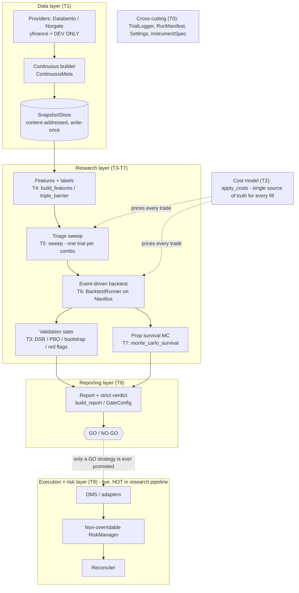

# futures-engine

A research-and-execution system for systematic trend/momentum trading of CME
micro futures (**MES** / **MNQ**). It is built to earn the right to trade a
strategy: every candidate runs a gauntlet of anti-overfitting statistics and a
prop-account survival Monte Carlo, and is only ever believed when a strict,
mechanical **GO / NO-GO** verdict says so.

The end-to-end pipeline shipped here is **research only** — it produces a report,
it does **not** trade live. The live execution/risk layer exists (see the
architecture below) but is deliberately never invoked by the research chain.

---

## One command

```bash
python -c "from pathlib import Path; from futures_engine.pipeline.run import run_pipeline; \
print(run_pipeline('examples/mes_momentum_demo/config.yaml', \
settings_dir='configs', snapshot_root='examples/mes_momentum_demo/snapshots', \
out_dir='out').run_dir)"
```

This runs the whole chain offline against the bundled synthetic snapshot and
writes a run-scoped report directory (`report.md`, `report.html`, `verdict.json`,
`manifest.json`). The bundled demo is an **honest NO-GO**: a plausible-but-not-
winning momentum sweep on drift-free synthetic data — proof the system can say no.
See `examples/mes_momentum_demo/`.

---

## Architecture

The system is a layered pipeline. Data is immutable and content-addressed; every
number downstream flows through the single cost model; nothing is believed until
the verdict clears every gate.



Key seams:

- **T2 cost model is the single fill/cost authority.** The event backtester runs
  Nautilus with a zero fee model and re-prices round-turns through `apply_costs`,
  so gross-vs-net is honest and computed one way everywhere.
- **Snapshots are content-addressed and write-once**, so a run's inputs can never
  mutate under it; the `RunManifest` pins snapshot + config + seed + git SHA.
- **The `TrialLogger` is append-only** and is the source of the honest DSR trial
  count (see below).

---

## The validation gates (the verdict)

A run is **GO only if every gate passes AND no `severity="fail"` red flag fired**.
Thresholds live on `GateConfig` (`futures_engine/report/builder.py`), never as
magic constants:

| gate | rule | default |
| --- | --- | --- |
| survival | prop-account `p_survival` ≥ `min_survival` | **0.90** |
| deflated Sharpe | `DSR` ≥ `min_dsr_p` (P[edge is real], selection-bias corrected) | **0.95** |
| PBO | `PBO` ≤ `max_pbo` (P[backtest overfit], via CSCV) | **0.50** |
| red flags | no `severity="fail"` flag (edge survives 1-bar delay AND costs) | — |

**Honest Deflated Sharpe (G10).** The DSR deflation benchmark grows with the
number of configurations tried, so the trial count must be honest. It is read
directly from `TrialLogger.count(strategy_family=...)` after the sweep has logged
one trial per grid combination — never hard-coded — and the report prints it
alongside a trial-list hash. More trials tried ⇒ a higher benchmark ⇒ a lower DSR.

Also reported: gross-vs-net performance, CV scheme + PBO, a stationary
block-bootstrap Sharpe CI, survival probability with its 90% CI and bust reasons,
every red flag, and the full reproducibility manifest.

---

## Config surface

All configuration is validated pydantic (`extra="forbid"` — a typo fails loudly).

| file | model | holds |
| --- | --- | --- |
| `configs/instruments.yaml` | `InstrumentSpec` | tick economics per symbol (MES, MNQ) |
| `configs/costs.yaml` | `CostConfig` | commission / fees / spread / slippage / delay |
| `configs/prop_rules.yaml` | `PropRuleSet` | prop-firm evaluation presets |
| `examples/*/config.yaml` | `PipelineConfig` | a run: instrument, signal, grid, snapshot, preset, gates |

`Settings.load(configs/)` loads the first three; `PipelineConfig.load(...)` loads
a run config. `GateConfig` carries the verdict thresholds.

### Prop presets (`configs/prop_rules.yaml`)

Current published **50K** evaluation rules (retrieved 2026-07-25; confirm before
live use — firms revise terms often):

| preset | trailing | mode | daily loss | consistency | target |
| --- | --- | --- | --- | --- | --- |
| `topstep_50k` | $2,000 | end-of-day, freezes at start | $1,000 | 50% | $3,000 |
| `mffu_50k` | $2,000 | end-of-day, freezes at start | none | 50% | $3,000 |
| `apex_50k` | $2,000 | intraday unrealized | none | none | $3,000 |

---

## How to add a provider

1. Add an adapter under `futures_engine/data/adapters/` implementing the provider
   protocol (`futures_engine/data/provider.py`); import the vendor SDK **lazily**
   inside the fetch method and raise a clear error naming the optional extra if it
   is missing.
2. Declare the SDK as an optional extra in `pyproject.toml` (never a core dep).
3. Produce validation-grade `DatasetMeta` with `ContinuousMeta` for futures, then
   persist via `SnapshotStore.save`.

## How to add a strategy

1. Implement a `VectorSignal` (a `family` label + `generate(bars, params) -> Series`
   returning a raw target position in `[-1, 1]`); see
   `futures_engine/research/strategies/momentum.py`. Read every numeric parameter
   from `params` — no magic constants.
2. Register it in `SIGNAL_REGISTRY`
   (`futures_engine/backtest/strategy_adapter.py`) under a stable key.
3. Point a `PipelineConfig` at it (`signal:` + `grid:`) and run the pipeline.

---

## yfinance policy — NOT FOR VALIDATION (G1)

`yfinance` is a **development-only** convenience source. Its data is never
validation-grade and is **refused** by every research / backtest / validation
path: `require_validation_grade` raises `DataIntegrityError` on dev-grade data.
The SDK is imported **only** in `futures_engine/data/adapters/yfinance_dev.py`
(a dev-only optional extra), and a repo-wide AST + substring test
(`tests/test_no_yfinance.py`) enforces that it never leaks into a decision path.

---

## Development

```bash
python -m venv .venv
.venv/Scripts/pip install -e ".[dev]"     # Windows; use .venv/bin on POSIX
.venv/Scripts/pytest                       # full suite, offline
.venv/Scripts/ruff check . && .venv/Scripts/ruff format --check .
.venv/Scripts/mypy                         # strict on futures_engine/
```

All tests are offline and deterministic (seeded synthetic fixtures; no network).
